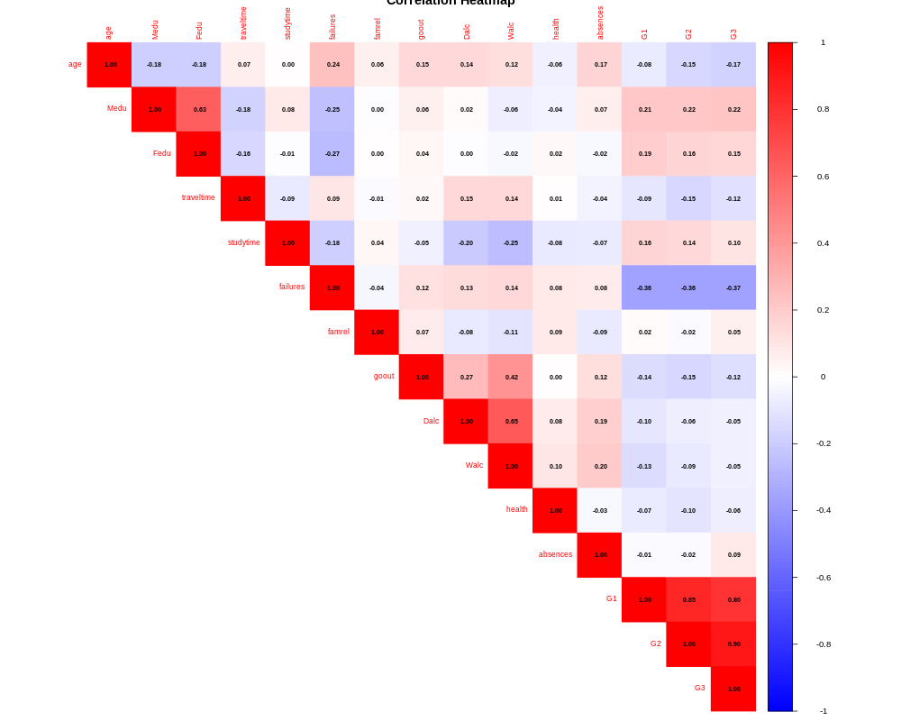

# 📊 Student Performance Analysis

## 📖 Overview

The main goal of this project is to analyze how different factors influence students' final grade (G3).

---

## 🎯 Objectives

* Analyze the relationship between all variables and the final grade (G3)

---

## 📊 Correlation Heatmap

---

## 🔍 Key Insights

### 1. Strong Relationship with Prior Performance (G1 & G2)

There is a very strong positive correlation between previous grades (G1 and G2) and the final grade (G3).
This indicates that students’ academic performance is highly consistent over time.

---

### 2. Failures as the Strongest Negative Factor

Among all variables, past failures show the most noticeable negative relationship with G3.
Students with more previous failures tend to achieve lower final grades.

---

### 3. Weak Influence of Study Time

Study time shows only a weak positive correlation with G3, suggesting that the quantity of study alone is not a strong predictor of performance.

---

### 4. Minimal Impact of Social and Lifestyle Factors

Variables such as going out with friends (goout) show a very weak relationship with academic performance.

---

### 5. Absences Have Limited Predictive Power

Absences show a very weak correlation with G3, indicating that attendance alone is not a strong indicator of final academic performance in this dataset.

---

### 6. Important Note on Interpretation

Correlation does not imply causation. Some relationships may be indirect or influenced by other underlying factors (e.g., age and failures).

---

## 🛠️ Tools Used

* R
* dplyr
* corrplot

---

## 👩‍💻 Author
(Bayan Almalawi)
